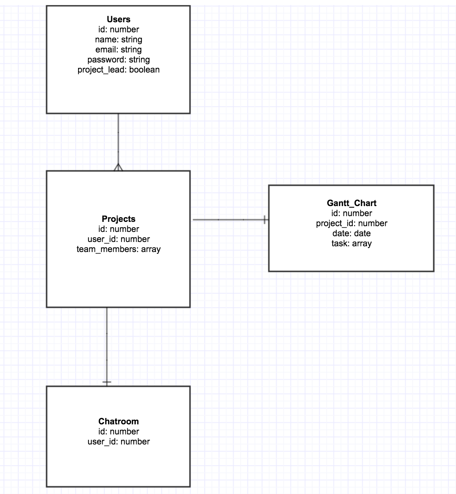
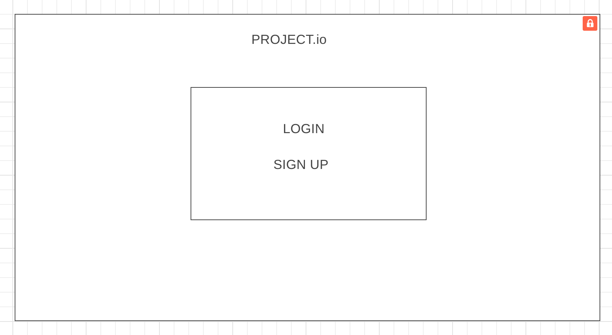
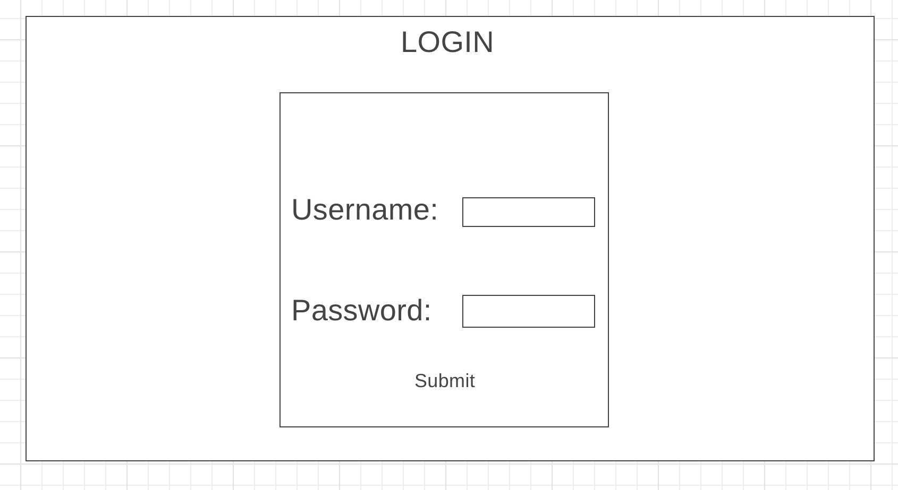
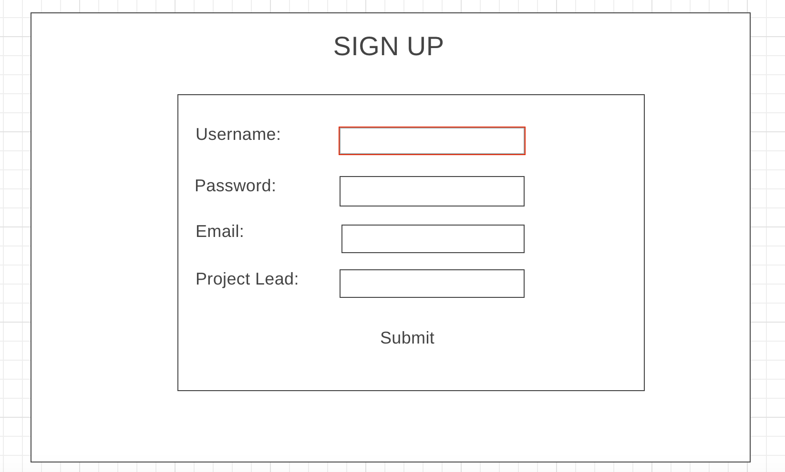
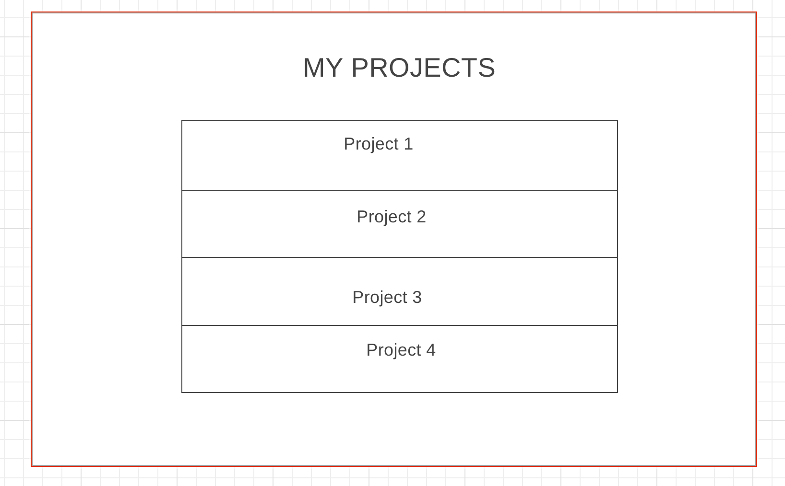
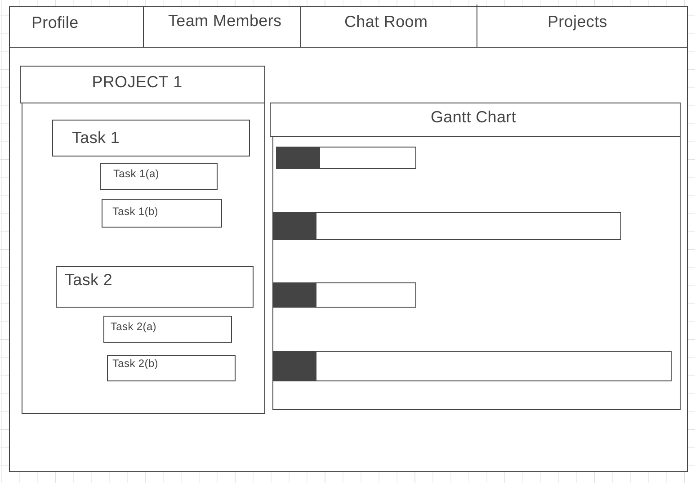
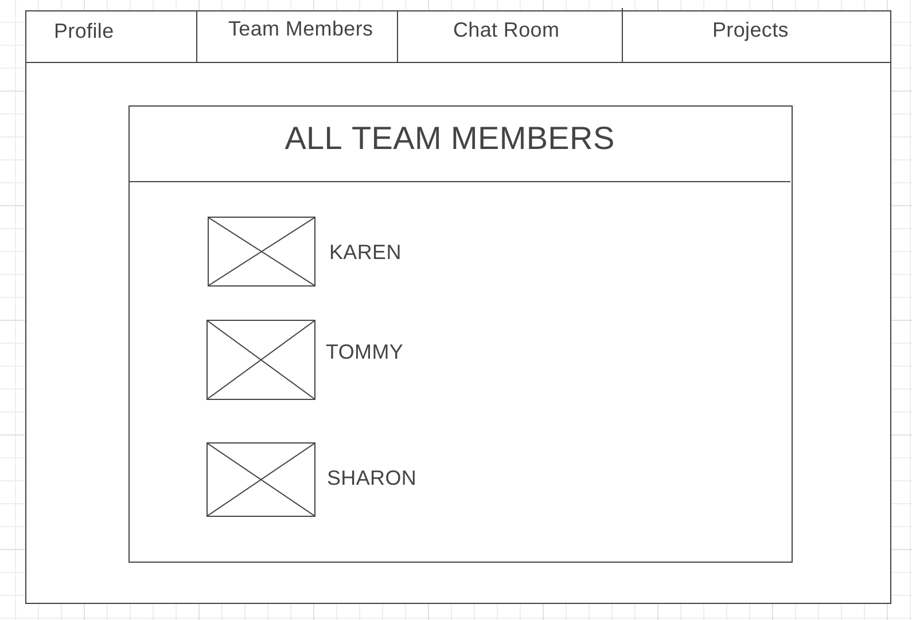
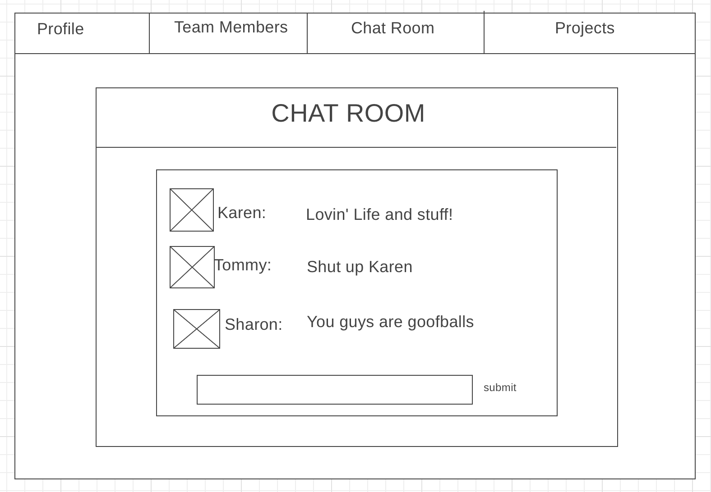
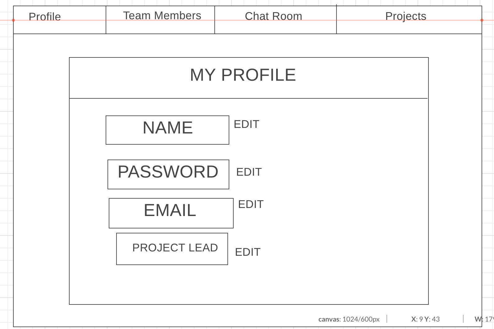

# Project.io

**Project Description:**
Project.io is a project management app that will help you stay organized and deliver on time.  All of your tasks, schedules, conversations, and team member output can now be found in one place with a simple and straightforward design.  Project.io allows you and your entire team to see the big picture so you'll always know exactly where you stand and what needs to be done.  

**Technologies Used:**

- Meteor-Blaze
- HTML / Styl / Javascript
- Heroku

**Approach Taken**
- Brainstormed
- Settled on Gantt Chart idea
- Read loads of documentation

**Link to Trello:**  https://trello.com/b/fxfg7jHG/project-4

**ERD:**

**Wireframes:**

**Unsolved Problems**
- Gantt Chart
- Styling
- User Accounts: Full CRUD, OAuth
- Issues with Completed and Over Due field showing in the individual project view
